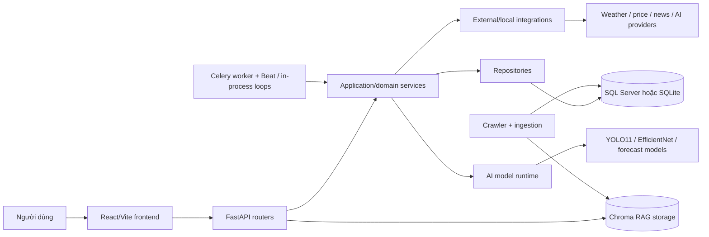
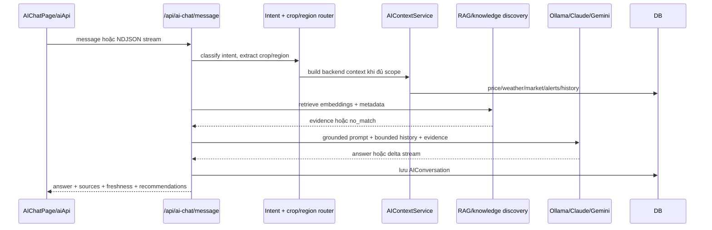

# AgriAI — bản đồ kiến thức cho AI Engineer

> Cập nhật theo mã nguồn hiện tại ngày 2026-09-22. Đây là tài liệu onboarding và học kiến trúc; khi sửa code, luôn đọc lại `CONTEXT-MAP.md` và context cụ thể của subsystem.

## 1. AgriAI là gì?

AgriAI là nền tảng hỗ trợ quyết định cho nông nghiệp Việt Nam. Hệ thống kết hợp:

- dữ liệu giá và tin tức thị trường;
- thời tiết, cache và cảnh báo rủi ro;
- quản lý mùa vụ, lịch thu hoạch;
- kiểm tra chất lượng nông sản qua ảnh;
- trợ lý AI có intent routing, dữ liệu backend, RAG và trích dẫn;
- crawler, ingestion, background refresh và notification.

Điểm quan trọng: đây không chỉ là một chatbot. Đây là hệ thống dữ liệu thật + ML inference + LLM/RAG + web application.

## 2. Bản đồ kiến trúc tổng thể



Luồng tư duy chuẩn:

```text
UI event
  -> API contract/schema
  -> service điều phối nghiệp vụ
  -> repository hoặc integration
  -> database/cache/model
  -> response có source/freshness/status
  -> frontend hiển thị hoặc báo unavailable
```

## 3. Cấu trúc repository

| Khu vực | Vai trò | Điểm vào nên đọc |
| --- | --- | --- |
| `backend/app/api` | HTTP routers, auth dependency, request/response | `backend/app/main.py` |
| `backend/app/services` | Nghiệp vụ và orchestration | `agri_data_aggregator_service.py`, các service theo domain |
| `backend/app/repositories` | Truy vấn/upsert database | repository tương ứng với domain |
| `backend/app/models` | SQLAlchemy ORM và quan hệ dữ liệu | `user.py`, `crop.py`, `price.py`, `knowledge.py`, `weather.py` |
| `backend/app/schemas` | Pydantic contracts cho API | schema theo domain |
| `backend/app/integrations` | Adapter tới Ollama, Gemini, Claude, Tavily, Open-Meteo, RSS, nguồn giá | `ai_provider.py`, các client |
| `backend/app/tasks` | Celery tasks, scheduled jobs, refresh, discovery | `celery_app.py` |
| `backend/ai_models` | Runtime inference và predictor | `fruit_quality_pipeline.py`, `price_forecast/predictor.py` |
| `backend/crawler` | Scrapy spiders/pipeline và task cũ/độc lập | `spiders/`, `pipelines.py` |
| `frontend/src/pages` | Route-level screens | `App.jsx`, `routes/appRoutes.js` |
| `frontend/src/services` | Frontend API clients | `api.js`, `aiApi.js` |
| `frontend/src/components` | UI components và domain widgets | `QualityCheck`, `Pricing`, `HarvestForecast` |
| `frontend/src/utils` | Data trust, formatting, source metadata, risk | `dataTrust.js`, `sourceMeta.js` |
| `training/quality` | Dataset split, EfficientNet training, checkpoint | `prepare_dataset.py`, `train_quality_cnn.py` |
| `training/yolo` | YOLO11 recipe/notebook/dataset config | `recipe.py`, `data.yaml` |
| `docs` | Context, API, database, deployment, redesign reports | `CONTEXT-MAP.md`, `docs/project/` |
| `scripts`, `infra`, `storage` | Setup, smoke/deploy helpers, runtime files, raw crawl/upload/RAG | đọc cùng README trước khi vận hành |

Context bắt buộc:

- `CONTEXT-MAP.md` chọn context theo subsystem.
- `backend/CONTEXT.md` quy định backend/RAG phải lưu dữ liệu người dùng trước khi báo thành công, validation và metadata nguồn.
- `frontend/CONTEXT.md` quy định UI không được trình bày mock/sample như dữ liệu thật.
- `training/yolo/CONTEXT.md` quy định confidence phải đến từ inference thật.

## 4. Runtime và deployment

### Docker development

`docker-compose.yml` chạy:

1. SQL Server ở `1433`;
2. Redis ở `6379`;
3. FastAPI ở `8000`;
4. React/Vite ở `5173`;
5. worker Celery với Beat.

Ollama mặc định chạy ngoài container trên host; container gọi qua `host.docker.internal`.

### Home/production-like

`compose.home.yml` dùng SQL Server, Redis, volume cho RAG/upload, frontend production và Cloudflare Tunnel. Các cờ an toàn chính:

```text
ENVIRONMENT=production
ALLOW_MOCK_DATA=false
ALLOW_SAMPLE_DATA=false
USE_REALTIME_ONLY=true
```

`docker-compose.prod.yml` là cấu hình legacy PostgreSQL; không nên coi đó là runtime chính nếu chưa kiểm tra lại driver/schema.

### Lifespan và background work

`backend/app/main.py` khởi tạo database rồi khởi chạy các loop trong process:

- crawler loop;
- real-data refresh loop;
- alert evaluator loop.

Worker riêng dùng `backend/app/tasks/celery_app.py` với Beat để lập lịch crawler, refresh official price/news, alert, cleanup upload, knowledge ingestion và source discovery. Vì tồn tại cả in-process loop lẫn Celery, khi sửa scheduling phải kiểm tra nguy cơ chạy trùng.

## 5. Backend theo các layer

### 5.1 API layer

`main.py` include các router cho auth, AI chat, assistant library, dashboard, crop, weather, pricing, price forecast, harvest/season, quality, market/news, alert/notification, settings và admin.

Router nên làm các việc sau:

- parse/validate input qua Pydantic;
- lấy `db` và current user bằng dependency;
- gọi service;
- chuẩn hóa error/response;
- không chứa thuật toán domain dài.

### 5.2 Service layer

Service là nơi điều phối use case. Một facade đáng chú ý là `AgriDataAggregatorService`, dùng chung cho Dashboard, AI Chat, Alerts, Harvest và Pricing. Nó gom các bundle:

- pricing: current price, history, forecast, recommendation;
- weather: current, forecast, risk, farming recommendation;
- market: news, trends, opportunities, risks;
- alert/notification;
- quality history và harvest status;
- user settings.

`AIContextService` chỉ gọi đúng nhóm dữ liệu theo intent. Các nguồn độc lập chạy song song bằng session riêng, có ngân sách khoảng 3.5 giây; nguồn chậm trả metadata lỗi/cache thay vì chặn cả câu trả lời.

### 5.3 Repository/model/schema

- Model là persistence shape của SQLAlchemy.
- Repository che truy vấn phổ biến, upsert, history và ownership.
- Schema là public contract của API.
- Khi thay đổi field response, phải kiểm tra cả backend schema, frontend service, UI state và tests.

Các nhóm dữ liệu chính hiện tại gồm Users, CropTypes, MarketPrices, PriceHistory, PriceForecastResults, HarvestSchedule/Forecast, QualityRecords, Weather*, MarketNews/Analysis, Alerts/Notifications, Settings, AIConversations, KnowledgeDocuments/SourceCandidates/DiscoveryJobs, ingestion logs, dashboard cache và support requests. Vì vậy tài liệu database cũ ghi “10 tables” không còn là toàn bộ mô hình hiện tại.

## 6. Data trust: nguyên tắc xuyên suốt

Mỗi payload dữ liệu quan trọng nên trả được:

```text
source / source_name / source_url
fetched_at / last_updated / data_age_minutes
cache_status
is_realtime / is_cache / is_mock
confidence / warning / error
```

`backend/app/core/real_data.py` định nghĩa cache TTL, stale TTL, cache status và circuit breaker. `data_source_service.py` gom/chuẩn hóa metadata đệ quy. `api/response.py` tạo response envelope. Frontend `utils/dataTrust.js` và `sourceMeta.js` dùng các trường này để quyết định hiển thị.

Quy tắc sản phẩm:

- thiếu dữ liệu thật thì hiển thị unavailable, không thay bằng số 0;
- không trộn mock/sample với production;
- hiển thị source và freshness cùng với số liệu;
- cache cũ phải có warning;
- fallback chỉ được nói rõ là fallback, không giả làm realtime.

## 7. Luồng AI Chat end-to-end



Chi tiết:

1. Frontend gửi `POST /api/ai-chat/message` hoặc `POST /api/ai-chat/message/stream` qua `frontend/src/services/aiApi.js`.
2. Backend `ai_chat.py` nhận message, session history, crop/region explicit hoặc trích xuất từ câu hỏi.
3. `ai_intent_service.py` dùng rule-based classifier cho price, weather, harvest, quality, alert, full-farm, cultivation, livestock, greeting/general.
4. Greeting/capability/câu hỏi cần làm rõ được trả trực tiếp bằng router; không gọi LLM không cần thiết.
5. Với analysis intent có crop + region, `AIContextService` lấy dữ liệu thật song song.
6. `rag_service.py` embed query qua Ollama `/api/embed`, tìm trong Chroma collection của system owner và user owner, lọc crop/metadata, giới hạn top-k/chunk/document.
7. Nếu RAG `empty` hoặc `no_match`, `knowledge_discovery_service.py` có thể enqueue query-triggered discovery qua Celery; livestock/cultivation có safety reply nếu chưa có nguồn.
8. Provider được chọn bởi `AI_PROVIDER`: Ollama mặc định; Gemini/Claude là lựa chọn cấu hình.
9. Prompt grounding đưa backend data đã tính sẵn và evidence vào model. `ai_grounding.py` kiểm tra số liệu bịa và nhắc rõ vùng không có dữ liệu.
10. Kết quả được lưu vào `AIConversations`, trả kèm intent, provider/model, sources, reasons, recommendations, history state và timing.
11. Streaming dùng NDJSON: status → delta → complete/error. Frontend có fallback về JSON nếu streaming/proxy hỏng.

Điểm thiết kế quan trọng: LLM chủ yếu diễn đạt; backend tính số và quyết định dữ liệu được phép dùng.

## 8. RAG và knowledge lifecycle

```text
configured source / user upload / discovered candidate
  -> validate URL/domain/public IP
  -> fetch
  -> extract HTML/PDF/TXT/MD
  -> normalize + hash + deduplicate + version
  -> quality report: length + agriculture terms + question coverage
  -> pending
  -> approved / rejected / failed
  -> embed qua Ollama
  -> publish vào Chroma
  -> retrieve với source metadata và citation [TLn]
```

`KnowledgeIngestionService` có các chốt an toàn: allowed domain, redirect giới hạn, không private IP/SSRF, kích thước/text giới hạn, content hash, superseded version và quality gate. `SourceDiscoveryService` chỉ tạo candidate để admin review; candidate chưa approve không tự thành nguồn active. Query discovery tìm nguồn chính thống Việt Nam và vẫn đi qua cùng ingestion/quality checks.

## 9. Các vertical slice AI/ML chính

### 9.1 Quality image analysis

```text
upload image
  -> Quality API
  -> QualityService
  -> YOLO11 detect objects
  -> EfficientNet-B0 classify crop/quality
  -> HSV freshness/color analysis
  -> map grade + defects + confidence
  -> lấy giá thật theo crop/region/grade
  -> lưu QualityCheck/QualityRecord
  -> trả annotated image + source metadata
```

Nếu không phát hiện được hoặc model không tải được, service trả lỗi phân tích; không gán grade giả. Runtime weight nằm ở `backend/ai_models/weights/`, training ở `training/yolo` và `training/quality`, đồng bộ bằng `scripts/setup_models.py`.

### 9.2 Price forecast

`PriceForecastService`:

1. đọc `PriceHistory`, fallback sang `MarketPrices` thật;
2. dùng `ai_models/price_forecast/predictor.py` với EMA nếu đủ dữ liệu;
3. fallback sang ngoại suy tuyến tính từ lịch sử thật;
4. nếu không đủ dữ liệu thì trả cache miss/error, không tạo chuỗi giá synthetic.

Tên “Prophet” trong một số README cũ không phản ánh predictor hiện tại; đọc code runtime trước khi thay model.

### 9.3 Harvest forecast

`HarvestService` + `harvest_forecast/predictor.py` dùng bảng thời gian sinh trưởng theo crop, ưu tiên duration từ DB, sau đó điều chỉnh theo trung bình thời tiết 7 ngày. Kết quả gồm ngày dự kiến, earliest/latest, risk, market condition, growth stages, preparation tasks và confidence.

Đây hiện là rule-based/weather-adjusted predictor, không nên gọi nhầm là model deep learning.

### 9.4 Pricing/market analysis

Pricing kết hợp MarketPrices/PriceHistory, nguồn chính thống, weather adjustment, seasonality, market news, retail snapshots và recommendation engine. News service merge official source, RSS và Tavily, lọc agriculture relevance, dedupe theo URL/title và cache Redis/DB.

## 10. Frontend

`frontend/src/App.jsx` chia route thành public và protected app shell. App shell gồm sidebar/navbar, lazy-loaded pages và error boundary.

- public: landing, features, articles, pricing plans, contact, login/register;
- authenticated: dashboard, reports, weather, pricing, crop, quality, season-management, alerts, notifications, AI chat, knowledge documents, settings, profile.

`api.js` là Axios boundary: base URL, timeout theo loại request, JWT interceptor, normalize API errors, redirect khi 401. `aiApi.js` thêm logic streaming/fallback. UI components phải dùng `StatusState`, `EmptyState`, source badge và data trust utils khi dữ liệu thiếu/chậm.

Định hướng UI là Prototype A “Field Command”, Vietnamese-first, Manrope/DM Sans, dark field shell và light data surfaces có kiểm soát.

## 11. Crawler, ingestion và cache

Nguồn ngoài đi qua integration client hoặc Scrapy spider, sau đó:

```text
fetch -> parse -> normalize crop/region/price/date
      -> reject corrupt/invalid record
      -> quarantine JSONL nếu bị loại
      -> upsert DB
      -> attach source/freshness/cache metadata
      -> service đọc cache trước, realtime khi miss/force refresh
```

`data_quality_service.py` là chốt dữ liệu: normalize tên, phát hiện text lỗi, kiểm tra số/date, tự scale một số đơn vị giá và ghi quarantine. Không được bypass chốt này để “có dữ liệu cho đủ UI”.

## 12. Liên hệ với năng lực AI Engineer

| Năng lực | Bài học trực tiếp trong dự án |
| --- | --- |
| Software architecture | API → service → repository → integration; dependency boundaries và contracts |
| Data engineering | crawler, normalization, dedupe, quarantine, freshness, cache và backfill |
| Classical ML | EMA forecast, rule-based harvest, confidence và fallback có điều kiện |
| Computer vision | YOLO detection, EfficientNet classification, HSV feature, annotation và model artifact |
| LLM engineering | intent routing, prompt construction, provider abstraction, streaming, token/context budget |
| RAG | chunking, embeddings, vector retrieval, metadata filter, citations, ingestion quality gate |
| AI safety | anti-fabrication number guard, topic safety, source matching, unavailable state |
| MLOps | training/inference separation, checkpoint deployment, Docker, scheduled refresh, model version |
| Backend engineering | FastAPI, Pydantic, SQLAlchemy, JWT, async/thread boundaries, rate limiting và resilience |
| Product engineering | data trust UI, user-facing warnings, explanation/recommendation và Vietnamese localization |
| Evaluation | unit/integration/E2E tests, AI grounding tests, stream serialization, no-fake-answer tests |

Tư duy cốt lõi:

```text
AI Engineer không chỉ “gọi model”.
AI Engineer xây data contract + evaluation + runtime + safety + product loop.
```

## 13. TDD và cách kiểm chứng thay đổi

Skill TDD áp dụng tốt nhất theo vertical slice, không phải viết hàng loạt test trước rồi mới code:

```text
RED: một test mô tả một hành vi public
GREEN: code tối thiểu làm hành vi đúng
REFACTOR: gom trùng lặp, làm module sâu hơn, vẫn giữ test xanh
```

Ví dụ hành vi nên kiểm chứng:

- price cache miss trả unavailable và không có số bịa;
- AI không giữ số của vùng A để trả cho vùng B;
- RAG không dùng tài liệu lệch crop/variety;
- stream phát đúng status/delta/complete;
- upload quality không nhận grade nếu model không phân tích được;
- production không render mock/sample payload.

Test hiện có đáng đọc trước:

- `backend/tests/test_ai_grounding.py`
- `backend/tests/test_ai_no_fake_answer.py`
- `backend/tests/test_ai_context_budget.py`
- `backend/tests/test_ai_rag_topic_safety.py`
- `backend/tests/test_ai_chat_stream_serialization.py`
- `backend/tests/test_answer_number_guard.py`
- `frontend/src/utils/__tests__/dataTrust.test.js`
- `frontend/src/services/__tests__/aiApi.stream-url.test.js`
- `frontend/tests/e2e/ai-chat-stream.spec.js`

Không test private implementation chỉ vì dễ mock. Ưu tiên gọi public API/service boundary và kiểm tra hành vi quan sát được.

## 14. Các điểm dễ học nhầm / cần cảnh giác

1. `docs/project/API_DOCUMENTATION.md` còn chứa mô tả cũ “chưa có authentication”; code hiện tại đã có JWT/auth dependency.
2. Một số README nói YOLOv8/Prophet; runtime hiện tại là YOLO11 + EfficientNet/HSV và predictor giá EMA/fallback lịch sử.
3. `docs/project/DATABASE_SCHEMA.md` mô tả 10 bảng cũ; ORM hiện tại có nhiều model hơn, nhất là knowledge, notification, dashboard, season và weather mở rộng.
4. Có nhiều API legacy song song (`/api/chat`, `/api/ai`, `/api/ai-chat`); khi sửa phải xác định frontend đang dùng route nào.
5. Có cả task loop trong FastAPI lifespan và Celery Beat; cần tránh double refresh/double alert.
6. `ALLOW_MOCK_DATA` và `ALLOW_SAMPLE_DATA` hữu ích cho development/test nhưng production phải tắt.
7. Worktree hiện có nhiều thay đổi/rename sẵn. Không reset hoặc ghi đè các file đó khi làm task khác.

## 15. Lộ trình học đề xuất

### Chặng 1 — hiểu hệ thống

Đọc theo thứ tự: `README.md` → `CONTEXT-MAP.md` → `backend/app/main.py` → `frontend/src/App.jsx` → `docker-compose.yml`.

### Chặng 2 — đi một request qua hệ thống

Chọn AI Chat: `AIChatPage.jsx` → `aiApi.js` → `api/ai_chat.py` → `ai_intent_service.py` → `ai_context_service.py` → `rag_service.py` → `ai_provider.py` → test.

### Chặng 3 — đi một pipeline dữ liệu

Chọn giá: crawler/integration → `data_quality_service.py` → repository/model → `pricing_service.py` → API → `pricingApi.js` → `PricingPage.jsx`.

### Chặng 4 — đi một pipeline ML

Chọn quality: dataset prep → training recipe → checkpoint → `fruit_quality_pipeline.py` → `quality_service.py` → quality API → frontend annotation/result.

### Chặng 5 — nâng cấp năng lực AI Engineer

Tập trung vào: evaluation set cho từng intent, retrieval precision/recall, grounding failure taxonomy, model/version registry, latency budget, cost/privacy trade-off, observability và rollback.

## 16. Lệnh làm việc cơ bản

```powershell
# Backend
cd backend
pytest

# Frontend
cd frontend
npm run test
npm run build
npm run check

# Docker
docker compose up -d --build
docker compose ps
docker compose logs -f backend
```

Khi thay đổi frontend, theo quy tắc repo phải chạy test và production build. Khi thay đổi backend/RAG, ưu tiên test public behavior và kiểm tra metadata nguồn/freshness/error path.

## 17. Tóm tắt một câu

AgriAI là một hệ thống AI ứng dụng hoàn chỉnh: dữ liệu thật được ingest và kiểm soát chất lượng, model được train/deploy riêng, LLM được grounding bằng backend context + RAG, còn frontend chỉ hiển thị kết quả cùng mức độ tin cậy và nguồn của nó.
